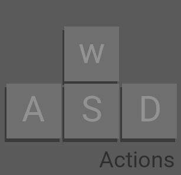

### First Person Point of View Input Actions for Godot
Keyboard actions for First Person Point of View.  

Automatically setups WASD input actions for the current project.  
The actions added after enabling this plugin:  
* `move_front`  - W keyboard key  
* `move_back` - S keyboard key  
* `move_left`     - A keyboard key  
* `move_right`    - D keyboard key  

Todo done: Introduce the standard `move_back` to replace `move_backward`, since it is more common to use `move_back`.  
Todo done: consider adding for easy conversion in CharacterBody3D:   
* `move_up`  - W keyboard key    
* `move_down` - S keyboard key    

Todo done: Replace `move_forward` with aesthetically pleasant `move_front` but keep `move_forward` for legacy/standard.
* `move_forward`  - W keyboard key  

These then can be used as a direct replacement in CharacterBody3D template script.
How to: 
1. Enable this plugin
2. Open `CharacterBody3D.gd`
3. Replace: `var input_dir := Input.get_vector("ui_left", "ui_right", "ui_up", "ui_down")`  
    With: `var input_dir := Input.get_vector("move_left", "move_right", "move_forward", "move_backward")`

[Note: due to signal emission problems, the editor do not show immediate changes in the Godot Editor Project Input Map Settings.](https://github.com/godotengine/godot/issues/80808#issuecomment-2799877255)   

____

Future Note: the CharacterBody3D template's `ui_` are not made to be overriden the entire vector variable should be tried to replace if it is possible using gd godot script.

wasd_setup_for_first_person_perspective
Godot-WASD-Input-Map_for-pov-first-person

3D First Person Adventure WASDEF Input Map Action  
3D First Person Shooter WASDEFTGHXQZC Input Map Action (R - Reload, C - Crouch, E - Interact, F - Toggle/Item, Q - QuickSwap, G - DropItem, I - Inventory, Z - LayingOnGround, T - Quests, P - Journal, M - Map, L- ?)  

3d-wasd-first-person-pov-input-actions  
3d-first-person-pov-wasd-input-actions  
3d-First-Person-POV-WASD-Input-Actions  

WASD-Input-Actions-for-3d-First-Person-POV

WASD_Input_Setup_for_first-person-POV

WASD Setup for 1st POV
FP_POV 
1st POV

Project Settings WASD Setup for First Person Perspective (Acitvate or Deactivate)
Automatically setups WASD input actions for the current project.
The actions added after enabling this plugin:
move_forward  - W keyboard key
move_backward - S keyboard key
move_left     - A keyboard key
move_right    - D keyboard key

walk_forward  - W keyboard key
walk_backward - S keyboard key
walk_left     - A keyboard key
walk_right    - D keyboard key

mouse_left  - left mouse button
mouse_right - right mouse button

Note: due to signal emission problems, the editor do not show immediate changes in the Godot Editor Project Input Map Settings. 
However all is working on activation and reloading project or closing/reopening project will make Godot Editor Input Map Settings UI to recognize.

References and acknowledgements  
https://github.com/godotengine/godot/pull/53296

https://docs.godotengine.org/en/stable/classes/class_projectsettings.html  

https://www.reddit.com/r/godot/comments/1dpmjgw/how_to_emit_signals_from_another_node/
https://docs.godotengine.org/en/stable/classes/class_editorplugin.html#class-editorplugin-signal-project-settings-changed

https://www.reddit.com/r/godot/comments/156vfhg/whats_the_difference_emit_signal_vs_signalemit/  

Research notes   
https://github.com/godotengine/godot/pull/80902
https://github.com/godotengine/godot-proposals/issues/7525
https://forum.godotengine.org/t/how-to-add-an-inputevent-to-inputmap-with-code/27923/5
https://docs.godotengine.org/en/stable/classes/class_editorsettings.html
https://docs.godotengine.org/en/stable/classes/class_projectsettings.html#class-projectsettings-method-set-restart-if-changed
https://docs.godotengine.org/en/stable/classes/class_%40globalscope.html#enum-globalscope-key
https://docs.godotengine.org/en/4.4/tutorials/inputs/inputevent.html#actions
